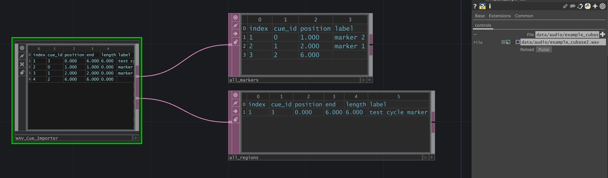
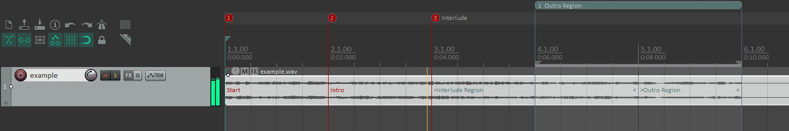
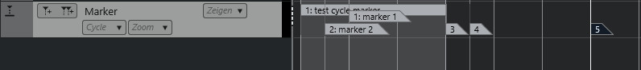
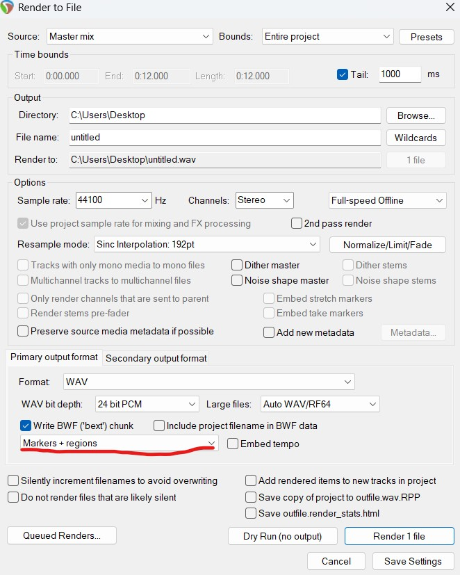
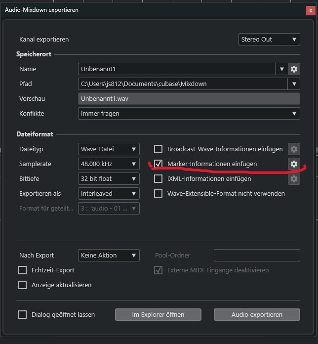

# TD-WAV_Cue_Importer

## Description

TouchDesigner Component for Importing Cue Metadata from .WAV Files. This includes Markers/Cue Points (Index, Position in s, comment/label) and Loops/Areas/Regions (Index, Start Position in s, End Position in s, Length in s, Comment/label). They're called 'Markers' & 'Regions' in Reaper and 'Markers' & 'Cycle Markers' in Cubase. In both DAWs, you can set the to-be-exported WAV File to include Markers (see Fig. 4. and Fig. 5). The tox component reads that Metadata (Cue, Labl, Ltxt, and Smpl chunks) from the .WAV File itself and writes it into structured DAT tables (see Fig. 1). Only tested with Reaper & Cubase, might work aswell with other DAWs that include similiar WAV File export options.

Notes:
- the order of imported cues (the assignment of cue_id by the DAWs Audio Render) - seems to differ from reaper to cubase:
    - Reaper exports all Markers and Regions in the order like they are placed in time on the timeline
    - Cubase seems to export all Markers first, in temporal order, then it exports cycle markers, aswell in temporal order 
    - It doesnt make a difference for the usage as the tox is splitting the table into single point markers and loops/regions/cycles and assigns index based on their temporal order per type, but thats why the cue_id might behave differently depending on the DAW used

- Note that if e.g. in Reaper multiple Markers are created, they get assigned some Marker_Id which is also displayed as Name if not given specific name, you can move the markers then and change their temporal order so that marker_id 2 would come before marker_id 1 in the timeline. This internal Marker_ID is not reflected in the cue_id that gets exported to the WAV file, the cue_id seems to get assigned as described above

- there is a bug that would fill the table with huge number of items containing only 0s, it occurs only sometimes when trying to import cue metadata from a WAV file which doesn't include any metadata about cues

 
 

*Fig. 1. Usage - Specify Audio File, Hit Reload - Get Marker & Region Data*
 
 
 

*Fig. 2. Setting Markers (Key: M) & Regions (Key: Shift+R) in Reaper*
 
 
 

*Fig. 3. Setting Markers and Cycle Markers in Cubase*
 
 
 

*Fig. 4. Export Markers and Regions (in)to the WAV File in Reaper*
 
 
 

*Fig. 5. Export Markers and Cycle Markers (in)to the WAV File in Cubase*

